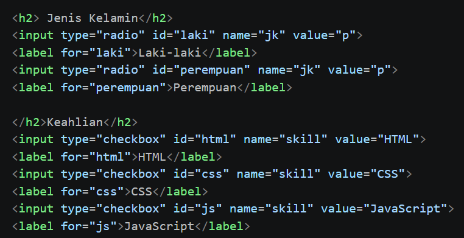
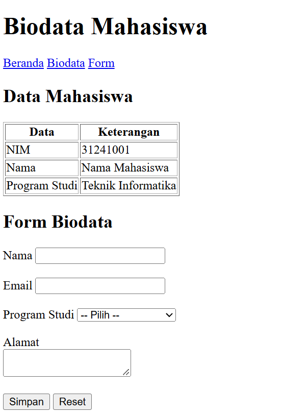

# Lab2Web - Praktikum 2 HTML Lanjutan

**Nama:** Amelia Futri  
**NIM:** 312510348  
**Program Studi:** Teknik Informatika  
**Universitas:** Universitas Pelita Bangsa  

## Deskripsi
Repository ini berisi latihan Praktikum 2 Pemrograman Web tentang HTML lanjutan, meliputi tabel, form, berbagai jenis input, semantic HTML, multimedia, dan validasi form dasar.

## Tujuan Praktikum
- Memahami penggunaan tabel HTML.
- Menggunakan form dan berbagai jenis input.
- Menerapkan semantic HTML.
- Menambahkan elemen multimedia.
- Menerapkan validasi form dasar.

## Struktur Repository
```text
Lab2Web/
├── index.html
├── biodata.html
├── media/
│   ├── audio.mp3
│   └── video.mp4
├── screenshots/
└── README.md
```
## Langkah Praktikum dan Hasil
### 1. Membuat Tabel Data Mahasiswa
Tabel dibuat menggunakan `table`, `tr`, `th`, dan `td` untuk menampilkan NIM, nama, serta program studi. Data dikembangkan menjadi tiga baris mahasiswa.

`

### 2. Mengembangkan Struktur Tabel
Tabel menggunakan `caption`, `thead`, `tbody`, dan `tfoot`. Atribut `colspan` digunakan untuk menggabungkan sel.

`

### 3. Membuat Form Registrasi
Form berisi input nama, email, password, tanggal lahir, serta tombol Daftar dan Reset.

`

### 4. Radio Button dan Checkbox
Radio button digunakan untuk pilihan jenis kelamin, sedangkan checkbox digunakan untuk memilih keahlian.



### 5. Select dan Textarea
Select menyediakan pilihan program studi dan textarea digunakan untuk mengisi alamat.

`

### 6. Validasi Form
Atribut `required`, `minlength`, `min`, `max`, dan tipe input digunakan untuk membantu memeriksa data sebelum dikirim.

`

### 7. Semantic HTML
Halaman menggunakan `header`, `nav`, `main`, `section`, `article`, `aside`, dan `footer` untuk membentuk struktur yang bermakna.

`

### 8. Multimedia
Elemen `audio` dan `video` disediakan. Letakkan file media yang digunakan ke folder `media` dengan nama `audio.mp3` dan `video.mp4`.

`

### 9. Proyek Mini Biodata Mahasiswa
File `biodata.html` menggabungkan tabel, form, semantic HTML, validasi, dan multimedia.

`

## Catatan
Screenshot pada repository perlu diisi dengan hasil praktik yang benar-benar diambil dari browser. File media juga perlu ditambahkan sendiri agar audio dan video dapat diputar. Form pada latihan ini merupakan contoh HTML; pengiriman data belum terhubung ke server.

## Kesimpulan
Berdasarkan seluruh kegiatan Praktikum 2 HTML Lanjutan, dapat disimpulkan bahwa praktikum ini memberikan pemahaman tentang pembuatan tabel, form, penggunaan berbagai jenis input, semantic HTML, multimedia, dan validasi form. Seluruh materi diterapkan dalam pembuatan halaman web dan proyek mini biodata mahasiswa. Melalui praktikum ini, mahasiswa memperoleh pengalaman dalam menyusun halaman web yang lebih terstruktur dan memahami fungsi berbagai elemen HTML.

## Soal dan jawaban
1. Apa fungsi '<table>', '<tr>', '<th>', dan '<td>'?

'<table>' berfungsi untuk membuat tabel dalam HTML. '<tr>' digunakan untuk membuat baris tabel, <th> untuk membuat sel judul atau kepala tabel, sedangkan <td> digunakan untuk mengisi data pada tabel.

2. Apa perbedaan <th> dan <td>?

<th> digunakan untuk membuat judul kolom atau baris yang biasanya ditampilkan dengan huruf tebal dan rata tengah. Sementara itu, <td> digunakan untuk menampilkan isi atau data dalam tabel.

3. Apa fungsi colspan pada tabel?

colspan berfungsi untuk menggabungkan beberapa kolom menjadi satu sel dalam tabel. Contohnya, colspan="2" berarti satu sel akan mencakup dua kolom.

4. Apa fungsi <form> dalam HTML?

<form> berfungsi untuk membuat formulir yang digunakan untuk mengumpulkan data dari pengguna, seperti nama, email, kata sandi, atau pesan, kemudian mengirimkan data tersebut untuk diproses.

5. Apa perbedaan radio button dan checkbox?

Radio button digunakan untuk memilih satu pilihan dari beberapa pilihan yang tersedia. Sementara itu, checkbox memungkinkan pengguna memilih lebih dari satu pilihan secara bersamaan.

6. Mengapa <label> sebaiknya terhubung dengan id input melalui atribut for?

Karena hubungan tersebut memudahkan pengguna memilih atau mengaktifkan input dengan mengeklik teks label. Selain itu, hubungan ini membantu meningkatkan aksesibilitas formulir, terutama bagi pengguna pembaca layar.

7. Apa perbedaan <textarea> dengan input type text?

<textarea> digunakan untuk memasukkan teks panjang yang terdiri dari beberapa baris, seperti komentar atau pesan. Sementara itu, input type="text" biasanya digunakan untuk memasukkan teks singkat dalam satu baris, seperti nama atau alamat.

8. Apa fungsi semantic HTML seperti <header>, <nav>, <main>, <section>, <article>, <aside>, dan <footer>?

Semantic HTML berfungsi untuk memberikan makna yang jelas pada setiap bagian halaman web. <header> digunakan untuk bagian kepala halaman, <nav> untuk navigasi, <main> untuk konten utama, <section> untuk mengelompokkan bagian konten, <article> untuk konten mandiri, <aside> untuk informasi tambahan, dan <footer> untuk bagian penutup halaman.

9. Apa fungsi required, min, max, dan minlength?

required digunakan agar kolom wajib diisi sebelum formulir dikirim. min menentukan nilai minimum yang diperbolehkan, max menentukan nilai maksimum, sedangkan minlength menentukan jumlah karakter minimum yang harus dimasukkan.

10. Apa perbedaan elemen <audio> dan <video>?

<audio> digunakan untuk menambahkan dan memutar suara atau musik pada halaman web. Sementara itu, <video> digunakan untuk menampilkan dan memutar video yang dapat dilengkapi dengan suara serta kontrol pemutaran.
