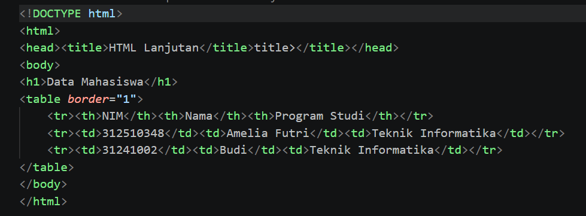
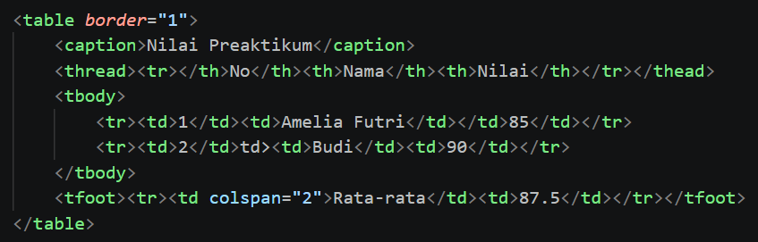
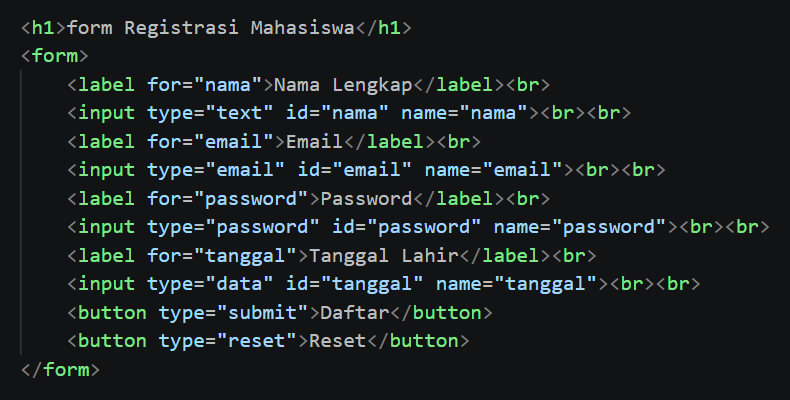
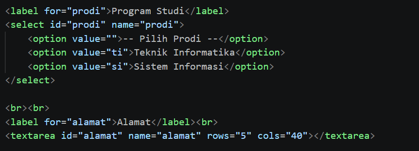
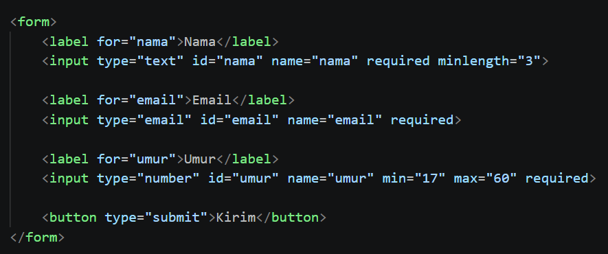
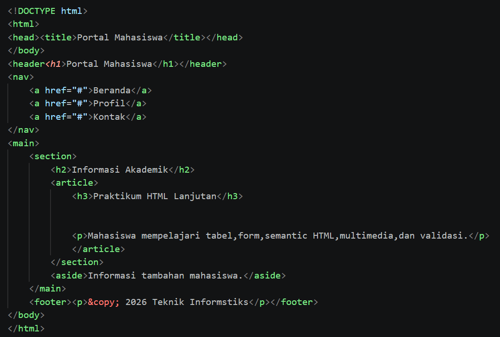
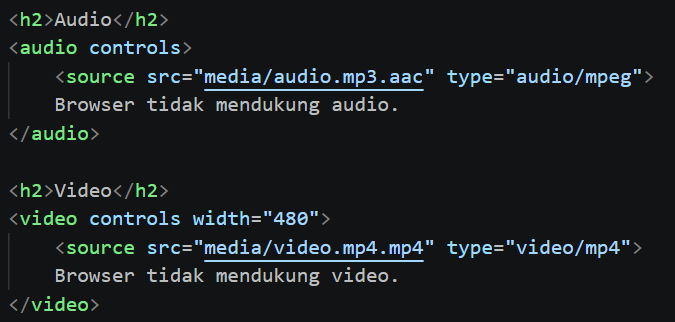

# Lab2Web - Praktikum 2 HTML Lanjutan

**Nama:** Amelia Futri  
**NIM:** 312510348  
**Program Studi:** Teknik Informatika  
**Universitas:** Universitas Pelita Bangsa  

## Deskripsi
Repository ini berisi latihan Praktikum 2 Pemrograman Web tentang HTML lanjutan, meliputi tabel, form, berbagai jenis input, semantic HTML, multimedia, dan validasi form dasar.

## Tujuan Praktikum
- Memahami penggunaan tabel HTML.
- Menggunakan form dan berbagai jenis input.
- Menerapkan semantic HTML.
- Menambahkan elemen multimedia.
- Menerapkan validasi form dasar.

## Struktur Repository
```text
Lab2Web/
├── index.html
├── biodata.html
├── media/
│   ├── audio.mp3
│   └── video.mp4
├── screenshots/
└── README.md
```
## Langkah Praktikum dan Hasil
### 1. Membuat Tabel Data Mahasiswa
Tabel dibuat menggunakan `table`, `tr`, `th`, dan `td` untuk menampilkan NIM, nama, serta program studi. Data dikembangkan menjadi tiga baris mahasiswa.

`

### 2. Mengembangkan Struktur Tabel
Tabel menggunakan `caption`, `thead`, `tbody`, dan `tfoot`. Atribut `colspan` digunakan untuk menggabungkan sel.

`

### 3. Membuat Form Registrasi
Form berisi input nama, email, password, tanggal lahir, serta tombol Daftar dan Reset.

`

### 4. Radio Button dan Checkbox
Radio button digunakan untuk pilihan jenis kelamin, sedangkan checkbox digunakan untuk memilih keahlian.

`

### 5. Select dan Textarea
Select menyediakan pilihan program studi dan textarea digunakan untuk mengisi alamat.

`

### 6. Validasi Form
Atribut `required`, `minlength`, `min`, `max`, dan tipe input digunakan untuk membantu memeriksa data sebelum dikirim.

`

### 7. Semantic HTML
Halaman menggunakan `header`, `nav`, `main`, `section`, `article`, `aside`, dan `footer` untuk membentuk struktur yang bermakna.

`

### 8. Multimedia
Elemen `audio` dan `video` disediakan. Letakkan file media yang digunakan ke folder `media` dengan nama `audio.mp3` dan `video.mp4`.

`

### 9. Proyek Mini Biodata Mahasiswa
File `biodata.html` menggabungkan tabel, form, semantic HTML, validasi, dan multimedia.

![biodata]schreenshoots/biodata.png.png)`

## Catatan
Screenshot pada repository perlu diisi dengan hasil praktik yang benar-benar diambil dari browser. File media juga perlu ditambahkan sendiri agar audio dan video dapat diputar. Form pada latihan ini merupakan contoh HTML; pengiriman data belum terhubung ke server.
